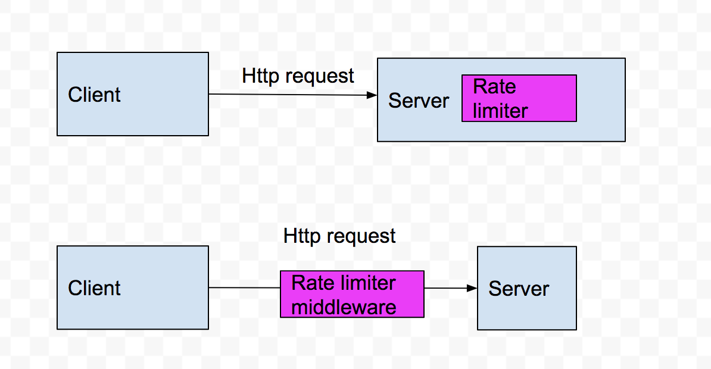

# System Design Volume 1 

## Chapter 2 - Back-Of-The Envelope Estimate
* You need to have a good sense of estimating to see how your designs meet design requirements
* An ASCII character uses one byte of memeory (8 bits) 

| Operation Name      | Time |
| -----------         | ----------- |
| LI Cache Reference  | 0.5 ns       |
| Branch mispredict   | 5 ns        |
| L2 cache reference  | 7 ns        |
| Mutex lock/unlock   | 100 ns       |
| Main memory reference  | 100 ns        |
| Compress 1k bytes with Zippy | 10k ns |
| Send 2k Bytes over 1 Gbps network   | 20k ns |
| Read 1 MB sequentially from memory  | 250k ns  |
| Round trip within the same datacenter | 500k ns  |
| Disk seek | 10 ms ns  |
| Read 1 MB sequentially from the network | 10 ms ns  |
| Read 1 MB sequentially from disk | 30 ms |
| Send pack CA => Netherlands -> CA | 150 ms |

* Memory is fast but the disk is slow
* Avoid disk seeks if possible
* Simple compression algos are fast
* Compress data before sending it over the internet if possible
* Data centers are usually in different regions, and it takes time to send data between them

* High Availability is the ability of a system to be continuously operational for a desirably long period of time. 
* HA is measured as a percentage
* SLA - Service Level Agreement and it defines the up time the service will deliver
* 99% = 3.65 days of downtime a year, 99.9999% = 31.56 seconds a year

Example: Estimate Twitter QPS and storage reqs:

Assumptions: 
  
  - 300 million monthly active users
  - 50% of users use Twitter daily
  - Users post 2 tweets per day on average
  - 10% of tweets contain media
  - Data is stored for 5 years
  
Estimations:

  - Daily active users (DAU) = 300 million * 50% = 150 million
  - Tweets QPS = 150 million * 2 tweets / 24 hour / 3600 seconds = ~3500
  - Peak QPS = 2 * QPS = ~7000
 
Media Storage: 

  * Average tweet size:
    * tweet_id: 64 bytes
    * test: 140 bytes
    * media: 1 MB

  - 150 * 2 * 10% * 1 MB = 30TB per day
  - 5-year media storage: 30 TB * 365 * 5 = ~55PB

* Commonly asked back-of-the-envelope estimates: QPS, peak, storage, cache, number of servers, etc..

## Chapter 3 - A Framework for System Design Interviews

* Step 1 (3 - 10 mins)- Understand the problem and establish design scope
    * Giving out an answer quickly without thinking gives you no bonus points.
    * You need to answer with thorough understanding of the requirements. It is not a trivia contest
    * Ask questions: "What specific feature are we going to build", "How many users does the product have", 
    "How fast does the company anticipate to scale up", "What is the companies technology stack"
* Step 2 (10 - 15 mins) - Propose high-level design and get buy-in
    * Come up with an initial blueprint for the design. Ask for feed-back
    * Draw box diagrams with key components
    * Do back of the envelope calcs
* Step 3 (10 - 25 mins)- Design deep dive
    * Identify and prioritize components in the architecture
* Step 4 (3 - 5 mins) - Wrap up 
    * Never say your design is perfect and nothing can be improved. 
    * Ask if the interview needs clarity on any approach
    
## Chapter 4 - Design a Rate Limiter

* A user can write no more than 2 posts per second
* You can create a maximum of 10 accounts per day from the same IP address
* You can claim rewards no more than 5 timers per week from the same device

Step 1 Understand the problem and establish design scope.
Client vs Serverside rate limiting:
Client - Throttling performed by the consumer
Server - Us setting a limit on how much a consumer can hit our endpoint

Questions to ask:
* Does the rate limiter throttle API requests based on IP, the user ID or other properties?
* Is this for a start up or large company
* Is the rate limiter a separate service or should it be implemented in application code?
* Do we need to inform users who are throttled?

Requirements:
* Accurately limit excessive requests
* Low Latency. The rate limiter should not slow down HTTP response time
* Use as little memory as possible
* Distributed rate limiting. The rate limiter can be shared across multiple servers or processes.
* Exception handling. Show clear exceptions to users when their requests are throttled
* High fault tolerance. If there are any problems with the rate limiter (for example, a cache server goes offline). 
It does not affect the entire system

Step 2 - Propose high-level design and get buy-in

[Middleware definition](https://stackoverflow.com/a/2904937/11615272).

Send a HTTP 429 - Status code meaning the client has sent too many requests when a client goes overboard with requests.

Rate limiting algorithms:
* Token Bucket
* Leaking bucket
* Fixed window counter
* Sliding window log
* Sliding window counter

Token bucket algorithm:
* A token bucket is a container that has pre-defined capacity. Tokens are put in the bucket 